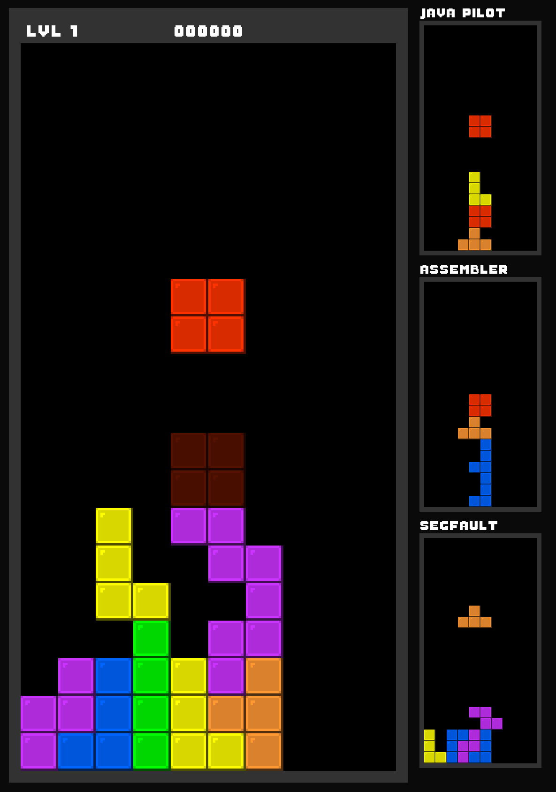

# Cpptris

Multiplayer/networked Tetris clone written in C++ using SFML

## Features

- Classic tetris gameplay
- Levels and score streaks
- Networked multiplayer for up to 4 players!
- Send lines to your friends when you clear 4 lines at once!

## Why?

Created as a quick hobby project to learn C++ coming from C.

Contains some hacky solutions and is quite non-scalable as a result. Memory leaks? Yes please.
For this project I focused more on getting stuff to work in C++ rather than making them pretty!

## Can I use this?

All code is released under the MIT license. Feel free to look around if you're interested in learning C++ as well.
You can use the code for whatever you want!

## How do I use this?

Code was written on macOS using CLion. You may have to modify the CMake file to work on your system.
The SFML library is required! Make sure you run the game with working directory in root so the `/assets/` folder is found.

For multiplayer, the client and server uses the std `<thread>` header which is not always available on all systems. As of right now, MinGW for windows does not include it by default. If you have problems with threading, you can always use the SFML threading API or some other system.
